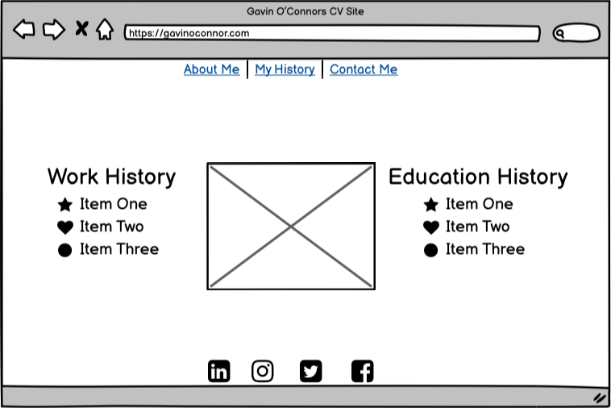
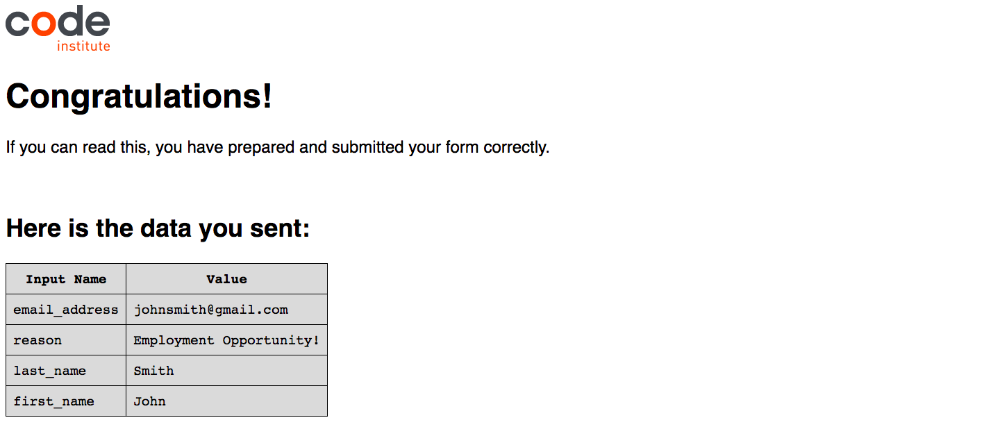
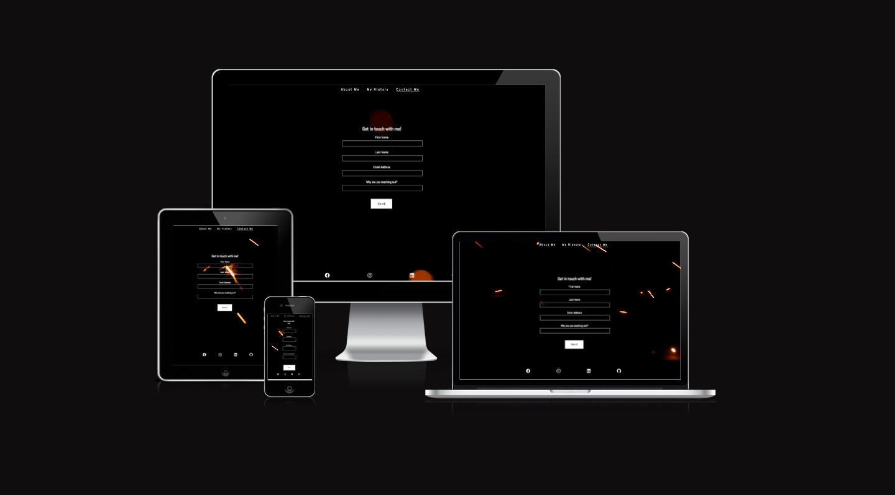
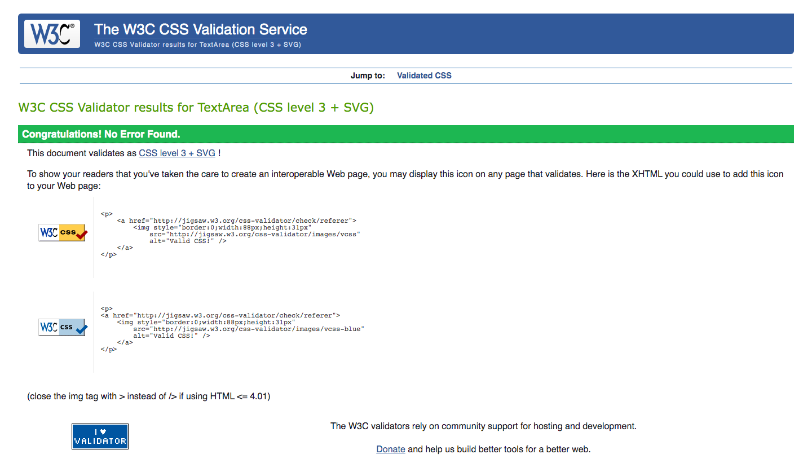

# Gavin O'Connor's Resume
Welcome! My name is Gavin O'Connor and this is my own personal resume/CV website. The purpose of this site is to provide all relevant information about myself and my career to prospective employers. In addition, the site itself also acts as a showcase of my coding ability and can be iterated upon as my coding knowledge grows and I learn new and ever more complex coding methods and languages.

This site contains more information about my personal work and education history, as well as a contact form with which employers can reach out to me with employment opportunities. As my portfolio of work grows, I intend to also include a page showcasing that work.

You can access my live site [here](https://gcgavinoc.github.io/project-1/).

# Table of Contents
[User Experience (UX) Design](#user-experience-ux-design)
 - [User Goals](#user-goals)
 - [User Expectations](#user-expectations)
 - [Color Scheme](#color-scheme)
 - [Images/Videos](#imagesvideos)
 - [Site Skeleton](#site-skeleton)

[Features](#features)
 - [Navigation bar](#navigation-bar)
 - [About Me page](#about-me-page-1)
 - [My History page](#my-history-page-1)
 - [Contact Form](#contact-form)
 - [Social Media Links](#social-media-links)

[Technologies used](#technologies-used)

[Testing](#testing)
 - [Google Chrome Developer tools](#google-chrome-developer-tools)
 - [Am I Responsive](#am-i-responsive)
 - [W3C Validator tools](#w3c-validator-tools)

# User Experience (UX) Design
[Go to top](#table-of-contents)

This websites primary goal is to act as a virtual CV for myself and my software development career. The website therefore needs to be clean and readable in it's design, but also appealing visually so as to showcase my coding abilities and knowledge. The main types of users who will be interacting with this site will be prospective employers looking to hire a software developer for their team or project, or someone looking to hire a programmer for freelance work.
## User Goals
[Go to top](#table-of-contents)

This website will act as both a means to showcase my work as a software developer, but also as a showcase itself. Prospective employers should have confidence in my abilities simply by navigating and interacting with this site.
## User Expectations
[Go to top](#table-of-contents)

- This site is designed using a minimalist design philosophy. The intention is to avoid clutter and to present only the most pertinent information about myself and my history.
- The site has a video background that makes the site more dynamic but is not too overt, so as to not distract from the content.
- The site is easy to Navigate, with the navigation bar being at the top and centered on the page, with the names of each link being clear in the content they will direct the user to on the site.
- The site is designed to be responsive for desktop, laptop, tablet and mobile screen sizes.
- The site has a simple and clear welcome page that the user will land on initially, this provides the very basic information about myself as a software developer including a profile picture style image of myself to make the site more personable.
- The second page includes the most relevant information on my work and education history, again, to avoid the site being too cluttered.
- The third page contains a form that allows employers to contact me, along with a text input field to enter a reason why. The purpose of this is to seperate the form entries of potential employers from other types of contact attempts, making it easier for myself to sort through later.
## Color Scheme
[Go to top](#table-of-contents)

The color scheme I chose for this site was decided upon with the minimalist design philosophy in mind. I decided to have the primary and secondary (or background and foreground) colors be total contrasts of each other, and therefore settled on black and white. The background video includes orange-red in it's visual flairs, and so I decided to make the tertiary (or highlight) color orange-red as well. Certain elements such as icons that act as bullet points for list items are colored orange-red so as to distinguish the list items from each other. As well as this, there are many items that will turn orange-red on mouse hover so that the user knows they are clickable or interactable, such as links or text fields.
## Images/Videos
[Go to top](#table-of-contents)

The background for this site across all of it's pages is a looping video, which makes the site feel more dynamic and visually appealing. It is not too overt however, as that may have caused users to watch the video and ignore the content on the page. The video simply uses a black background to contrast the white text, with orange-red visual flairs (sparks) moving across the screen in such a way that the looping nature of the video is not obvious to the user. The primary image I used is a profile picture style image of myself in the center of the about-me and my-history pages. This makes the site more personable, as users can put a face to the name as soon as they load the site, as well as when they read through my history.
## Site Skeleton
[Go to top](#table-of-contents)

The design of this website was conceptualized using wireframes from [Balsamiq](https://balsamiq.com/). This allowed me to visualize the layout of the site and it's three pages before I started coding, and thus gave me a better idea of what needed to be included in the code. Below are the wireframes for the three pages of the site. They are slighly different to the final site as I came up with new ideas and designs while the site was in development.

### **About me page**

### **My history page**

### **Contact me page**

# Features
[Go to top](#table-of-contents)

## Navigation bar
[Go to top](#table-of-contents)

The top of all three pages contains a navigation bar with three buttons, each linking to one of the three pages. The buttons have text that clearly defines the content of the page the button links to. The navigation bar is centered on the page with the buttons spread out evenly from each other. The buttons are white to contrast the black background, with the button for the page the user is currently on being underlined. The buttons turn to an orange-red color when the user hovers their mouse over them, so as to make it clear the button is interactable. An underline also appears when a user hovers over a not already selected button.

## About me page
[Go to top](#table-of-contents)

The purpose of this page is to act as a quick introducation to what the purpose of the site is, namely introducing myself, my career and the coding languages I know. This page will be the first page the user lands on, as it is the index page, and it makes it immediately clear to the user that this is a resume website for an individual person. This is done by introducing myself with my name and career title, as well as with a picture of myself which is animated to zoom in slightly on page load to draw the users eye to the page. The languages I know are also listed so as to not waste the time of any prospective employers who land on my page, if the language they are interested in their potential employees knowing is listed there they can explore the site further or leave if not.

There is also a button under the picture with the text "Reach out to me!". The reason for this button is to provide the user with a call to action. The end goal of my resume website is to have potential employers reach out to me with employment opportunities, so having this call to action front and center on the sites main page plants that idea in the mind of any user who visits my page. It also changes to an orange-red color when the user hovers their mouse over it to make it more dynamic, another level of incentive for the user to click on it.

## My history page
[Go to top](#table-of-contents)

This page gives a breakdown of my work and education history, split in two on either side of the profile picture which is animated in the same way as on the About Me page. So as to avoid clutter, I have only included the most important parts of my work and education history, with four examples on each side for the sake of symmetry. This layout and the format in which each example is given is similar to what would be seen on a typical resume/CV, driving home the point that this is a virtual resume site. Each example is bullet pointed with an icon symbolic of the nature of that example. The fourth example from work history is an icon of a laptop on a house, symbolising the work from home nature of that job.

## Contact form
[Go to top](#table-of-contents)

The third page feature a contact form so that the user can contact me with potential employment opportunities. It feature a text input field for first name, last name, and an email input field as well. The fourth field allows the user to enter a reason for why they are contacting me, so that I may better organise the completed contact forms I receive. The input fields change the color of their border to orange-red to show the user they are interactable, as well as the send button changing for the same reason. All fields are required to be filled in before sending and the email field requires an email address format to be entered. Sending a completed form for now will link to a form-dump site provided by code-institute (shown below), presenting the information that was submitted along with a message signifying that the info was submitted successfully. Once I gain a better understanding of other codeing languages such as Javascript, I will change this form to allow it to send to my personal email address.

## Social media links
[Go to top](#table-of-contents)

At the bottom of each page are various links to my social media channels. The links are done with icons of each of the respective social media platforms they represent. They are centered on the page and spread out evenly, similar to the navigation bar. They are white in color to contrast the black background and turn orange-red on mouse hover.

# Technologies used
[Go to top](#table-of-contents)

[HTML5](https://en.wikipedia.org/wiki/HTML) was used for structuring and presenting content of the website.

[CSS3](https://en.wikipedia.org/wiki/CSS) was used to provide the style to the content written in HTML.

[Balsamiq](https://balsamiq.com/) was used to create wireframes of the websites initial design.

[Google Fonts](https://fonts.google.com/) was used to import the font-family "Abel" into the css file. This font was used across all three pages.

[Font Awesome](https://fontawesome.com/) was used to import icons to the pages.

[Pexels](https://www.pexels.com/) was used to download the video background.

[Chrome's developer tools](https://developer.chrome.com/docs/devtools/) were used to debug and to test sites responsiveness. Their lighthouse feature as also used to generate a report on various aspects of the sites performance and functionality.

[Github](https://github.com/) was used to create the repository that hosts the site and to store the project's code after it was pushed from Git.

[Gitpod](https://gitpod.io/workspaces) was used as the Code Editor used for the site.

[Am I Responsive](https://ui.dev/amiresponsive) was used to test the sites responsiveness on various screen sizes.

[W3C Markup](https://validator.w3.org/) and [Jigsaw](https://jigsaw.w3.org/css-validator/) validation tools were used to validate the HTML code and CSS style used in the proejct.

# Testing
[Go to top](#table-of-contents)

## Google Chrome Developer tools
[Go to top](#table-of-contents)

This tool can be accessed by right clicking on a website and clicking on inspect in the menu that appears. I used this tool to check the responsiveness of the site by changing the size of the window that the site appears in. The screen sizes I checked were the same sizes displayed on the 'Am I Responsive' site, namely 1600x992px, 1280x802px, 768x1024px, and 320x480px. I also utilized the dev tools 'lighthouse' feature in order to generate a report that provides a score on the sites Performance, Accessibility, Best practices, and SEO. These reports are displayed below for each of the sites pages.

### **About me page**

### **My history page**

### **Contact me page**

## Am I Responsive
[Go to top](#table-of-contents)

This tool was used to check if the site was responsive for desktop, laptop, tablet, and mobile screen sizes. The site generates and image showing what the site will look like on each device type.

### **About me page**

### **My history page**

### **Contact me page**

## W3C Validator tools
[Go to top](#table-of-contents)

This tool was used to validate the HTML and CSS code used across the site. The code was entered into the tool using the direct input option. If there are any issues with the code, this tool will indicate as such by briefly describing the issue and then pointing to where the issue appears in the code along with a display of a snippet of the code in question and the problem highlighted.

Upon entering the HTML code for the About me and My history pages, two errors were displayed. The first was that the section element I was using for the main body of the About me page lacked a heading. I did not want to use a heading in this section, and so I changed the element in the code from a section to a div, which resolved the error. The second error, which appeared on both pages, was that I had a duplicate closing i element for the font awesome icon used on the Instagram social media link. I simply removed this duplicate element which resolved the error.

### **About me page**

### **My history page**

After I resolved these errors and once the site was complete, I validated my code for all three HTML pages and the CSS code again. This time, no errors were found.

### **About me page**

### **My history page**

### **Contact me page**

### **CSS Code**

## Manual Testing

The site was tested on the following screen sizes:
1600x992px
1280x802px
768x1024px
320x480px

Please find below the results of manually testing each feature across the above mentioned screen sizes.

### **Navigation bar**

TEST            | OUTCOME                          | PASS / FAIL  
--------------- | -------------------------------- | ---------------
Navigation bar | All navigation bar buttons appear correcly on page load accross all pages and screen sizes. They appear at the top of the page, centered on the page and with an even spread between each link button| PASS
About Me button | On page load of index page, About me button is underlined as currently selected page. Clicking the button again reloads the index/about me page. Hovering my mouse over the about me button changes it's color from white to orange-red| PASS
My History button | Clicking on the My History button loads the My history page, on the my history page the My History button is underlined as it is the currently selected page. Hovering my mouse over the my history button changes it's color from white to orange-red| PASS
Contact Me button | Clicking on the Contact Me button loads the Contact Me page, on the contact me page the Contact Me button is underlined as it is the currently selected page. Hovering my mouse over the contact me button changes it's color from white to orange-red| PASS
|||

### **About Me Page**

TEST            | OUTCOME                          | PASS / FAIL  
--------------- | -------------------------------- | ---------------
Greeting text | The Greeting text content loads correctly on page load, it appears in the correct position to the left of the profile picture on desktop and laptop sized screens, while appearing correctly above the profile picture on tablet and mobile sized screens. Font Awesome icon at the end of the text content loads correctly| PASS
Profile Picture | Profile picture loads correctly on page load, appearing correcly in between the two text contents on desktop and laptop sized screens and underneath the greeting text on tablet and mobile sized screens. The zoom in keyframe effect occurs correctly on page load| PASS
Languages text | The Languages text content loads correctly on page load, it appears in the correct position to the right of the profile picture on desktop and laptop sized screens, while appearing correctly below the profile picture on tablet and mobile sized screens. The Font Awesome icons at the beginning of each list item load correctly| PASS
|||

### **My History Page**

TEST            | OUTCOME                          | PASS / FAIL  
--------------- | -------------------------------- | ---------------
Work History | The Work History text content loads correctly on page load, it appears in the correct position to the left of the profile picture on desktop and laptop sized screens, while appearing correctly above the profile picture on tablet and mobile sized screens. The Font Awesome icons at the beginning of each list item load correctly| PASS
Profile Picture | Profile picture loads correctly on page load, appearing correcly in between the two text contents on desktop and laptop sized screens and underneath the Work History text on tablet and mobile sized screens. The zoom in keyframe effect occurs correctly on page load| PASS
Education History | The Education History text content loads correctly on page load, it appears in the correct position to the right of the profile picture on desktop and laptop sized screens, while appearing correctly below the profile picture on tablet and mobile sized screens. The Font Awesome icons at the beginning of each list item load correctly| PASS
|||

### **Contact Me Page**

TEST            | OUTCOME                          | PASS / FAIL  
--------------- | -------------------------------- | ---------------
Page title | The 'Reach out to me!' page title loads above the form correctly.| PASS
Contact Form | The contact form loads correctly, centered on the page on all screen sizes, with each input field stacked above each other vertically and the 'Send!' button at the bottom. The input fields change color from white to orange-red successfully on mouse hover as does the 'Send!' button. All input fields are required before the form can be sent with the email input field requiring an email address format. An error message appears on the corresponding input field if the 'Send!' button is clicked before these conditions are met. Successfully submitting the contact form presents a screen with a confirmation message and the information entered appearing in a table.| PASS
|||

### **Social Media Links**

TEST            | OUTCOME                          | PASS / FAIL  
--------------- | -------------------------------- | ---------------
Social media links | All social media links appear correcly on page load accross all pages and screen sizes. They appear at the bottom of the page, centered on the page and with an even spread between each link icon| PASS
Facebook link | The Facebook Font Awesome icon loads correctly on page load. When hovering my mouse over the icon it changes color from white to orange-red. When clicking the icon it opens up my personal Facebook page in a new tab| PASS
Instagram link | The Instagram Font Awesome icon loads correctly on page load. When hovering my mouse over the icon it changes color from white to orange-red. When clicking the icon it opens up my personal Instagram page in a new tab| PASS
LinkedIn link | The LinkedIn Font Awesome icon loads correctly on page load. When hovering my mouse over the icon it changes color from white to orange-red. When clicking the icon it opens up my personal LinkedIn page in a new tab| PASS
Github link | The Github Font Awesome icon loads correctly on page load. When hovering my mouse over the icon it changes color from white to orange-red. When clicking the icon it opens up my personal Github account in a new tab| PASS
|||

### **Video Background**

TEST            | OUTCOME                          | PASS / FAIL  
--------------- | -------------------------------- | ---------------
Video Background load | The video background loads and autoplays correctly and instantly on page load across all three pages and all screen sizes| PASS
Video loop | The video background loops correcly and smoothly across all three pages and all screen sizes with no interruption between loop cycles| PASS
Video screen size fit | The video background fits correctly on all screen sizes for all three pages. The video background covers the whole page with no gaps or margins and does not appear stretched or compacted on different screen sizes| PASS
|||

# Bugs
## Solved Bugs
- When entering the HTML code for the about me page into the W3C validator, I was presented with an error warning that the section element did not have an associated heading. I did not want to use a heading in this section so I changed the section element to a div element, which resolved the error the next time I validated the code.
- When entering the HTML code for both the about me and my history pages, I was presented with an error that there was a stray closing i element on the Instagram social media link Font Awesome icon. I deleted the stray element from both pages which resolved the error the next time I validated the code.
- Image and video assets were not loading correcly on page load on the live site after it was deployed. I discovered that this was because I had used the wrong file path from the HTML code to the image in the assets folder. I had included a / before assets in the file path. Once the / was removed the file path was functional and the image assets loaded correctly.

# Deployment

The site was deployed to GitHub pages using the following steps:

Navigate to Github - (https://github.com/)

Sign up to GitHub.

Create a new repository on GitHub called project-1.

Click on settings on the navigation bar under the repository title.

Select the pages tab on the left side menu bar.

Under source, click on the branch drop down menu, select main and click save.

The site will then deploy, which may take a few moments.

Refresh the page after a few minutes to see if the message "Your site is published at" appears with a green check mark.

This message will be accompanied by a link to the live deployed site - (https://gcgavinoc.github.io/project-1/)

# Acknowledgements

- The initial structure of the Navigation bar, Social media links, and contact form was borrowed from the Love Running project and then modified for this site.
- The initial keyframe animation code for the profile picture zoom effect was borrowed from the Love Running project and then modified for this site.
- Inspiration for the README.md file structure was taken from https://github.com/dhakal79/Portfolio-project-MS1
- The font used for the site was taken from [Google Fonts](https://fonts.google.com/).
- The various icons used for the site were taken from [Font Awesome](https://fontawesome.com/).
- The Video Background was downloaded from [Pexels](https://www.pexels.com/).
- Thanks to my mentor Marcel Mulders for his constructive feedback and guidance during the development of this project.